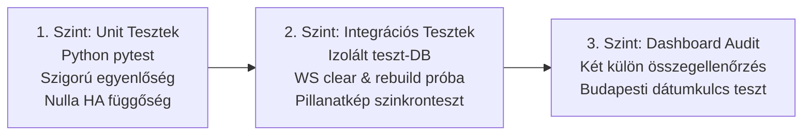

# Megvalósítási Specifikáció és Tesztszerződés: Gázóra Determinisztikus Interpolációja és Fokozatos Bevezetése (v8.1 - Véglegesített Rendszerspecifikáció)

> **Dokumentum státusza:** Önálló, teljes körű rendszerspecifikáció és tesztszerződés. Tartalmazza a budapesti időzónára illesztett lefedettség-lekérdezést, a közzétételi pillanatképet (snapshot), a több-epochos összegmegőrzési képletet és számszerű UT-09 tesztesetet, a Recorder rekord-indexelés pontos képletét, az UTC alapú időtartam- és DST-számítást, valamint az Energy átállás fázis szerinti elválasztását.

---

## 1. Számítási Pontosság és Determinisztikus Összegmegőrzés

### 1.1. Matematikai modell: Teleszkópos Kumulatív Integrálás (Cumulative Quantization)
Az órás vödrök felosztásánál a független kerekítésekből származó lebegőpontos maradékhibák (pl. $1.19999999...$) teljes kizárása érdekében a számítás determinisztikus kumulatív állapotokra támaszkodik:

* **Mértékegység és felbontás:** Gázköbméter 3 tizedesjegyig (`Decimal('0.001')`, liter pontosság).
* **Kerekítési szabály:** `ROUND_HALF_UP` (standard banki/pénzügyi kerekítés).
* **Időszámítási alapelv:** Időtartam-számítás, időbeli rendezés és órás diszkretizáció **kizárólag UTC időben** (`datetime.timezone.utc`) zajlik. A naptári határok leképezése történik helyi budapesti időzóna szerint (`zoneinfo.ZoneInfo("Europe/Budapest")`).
* **Képlet egy mérési intervallumra ($[t_L, t_R]$):** Legyen a mért fogyasztás $\Delta V = V_R - V_L$ (`Decimal`). Bármely $t_k \in [t_L, t_R]$ diszkrét időpontra a kumulált elméleti fogyasztás:
  $$S(t_k) = \operatorname{quantize}\left( \Delta V \times \frac{(t_k - t_L)_{\text{seconds}}}{(t_R - t_L)_{\text{seconds}}},\, \text{Decimal('0.001')} \right)$$
  Az egymást követő időpontok $[t_{k-1}, t_k]$ közé eső vödör fogyasztása:
  $$\text{bucket\_delta}_k = S(t_k) - S(t_{k-1})$$
* **Invariáns bizonyítása:** Mivel $t_0 = t_L \implies S(t_0) = 0.000$, és $t_N = t_R \implies S(t_N) = \Delta V$, az összeg teleszkópos összegként egyszerűsödik le:
  $$\sum_{k=1}^N \text{bucket\_delta}_k = \sum_{k=1}^N \bigl(S(t_k) - S(t_{k-1})\bigr) = S(t_N) - S(t_0) = \mathbf{\Delta V}$$

### 1.2. Több-epochos és mérőcsere esetén érvényes összegmegőrzési képlet
Amennyiben a kiértékelési időszak több mérési szakaszt (Epoch $e \in \{1, \dots, M\}$) érint (pl. fizikai mérőcsere történt), a különböző mérők nyers számlálóállásai közötti közvetlen kivonás értelmetlen.
A rendszerben mért **teljes összfogyasztás** a szakaszonként mért fogyasztások összege:
$$\mathbf{\Delta V_{\text{total}}} = \sum_{e=1}^M \Delta V_e = \sum_{e=1}^M \left( V_{e,\text{end}} - V_{e,\text{start}} \right)$$
A determinisztikus számítási motor által felosztott órás vödrök összegének szigorúan ezzel kell megegyeznie:
$$\sum_{k=1}^N \text{bucket\_delta}_k \equiv \mathbf{\Delta V_{\text{total}}} \equiv \sum_{e=1}^M \left( V_{e,\text{end}} - V_{e,\text{start}} \right)$$
* **Szigorú tesztkövetelmény:** A számítási motor unit tesztjeiben ennek az egyenlőségnek **szigorúan** kell teljesülnie 0,001 m³ felbontás mellett; lebegőpontos numerikus tolerancia (`pytest.approx`) használata tilos!

---

## 2. Lefedettségi Modell, Globális Intervallum-Unió és Publikációs Határok

### 2.1. Naptári napok lefedettségi állapota (Coverage State Machine)
Egy helyi naptári nap ($D$, `Europe/Budapest` időzóna szerinti éjféltől éjfélig tartó időszak) lefedettségét az érvényes mérési intervallumok globális uniója ($\mathcal{U}$) határozza meg:

* **`CLOSED` (Teljesen lefedett becslés):** A naptári nap teljes időtartama része az uniónak: $[D_{\text{start}}, D_{\text{end}}] \subseteq \mathcal{U}$.
  * *Fontos:* A lefedettség állapota kizárólag az időbeli átfedéstől függ, nem a fogyasztás nagyságától (a 0 m³-es fogyasztás önmagában nem tesz egy napot `CLOSED`-dá, ha a nap nincs elejétől a végéig lefedve!).
* **`PARTIAL` (Részben lefedett):** Az unió átfedése a naptári nappal nagyobb mint nulla, de nem fedi a teljes napot: $0 < |\mathcal{U} \cap [D_{\text{start}}, D_{\text{end}}]| < |[D_{\text{start}}, D_{\text{end}}]|$.
  * Példa: Hétfő 08:00 és Csütörtök 08:00 közötti 72 órás intervallum esetén:
    - Hétfő: `PARTIAL` (16 óra fedett, 8 óra hiányzik);
    - Kedd: `CLOSED` (24 óra teljes egészében fedett);
    - Szerda: `CLOSED` (24 óra teljes egészében fedett);
    - Csütörtök: `PARTIAL` (8 óra fedett, 16 óra hiányzik).
* **`OPEN` (Nyitott / Lefedetlen):** Az adott naptári napra nincs egyetlen érvényes mérési intervallum sem ($|\mathcal{U} \cap [D_{\text{start}}, D_{\text{end}}]| = 0$).

> [!IMPORTANT] Hiányzó adatok és éjfél kezelése
> Új fotó hiányában **az éjfél önmagában nem szolgáltat jobb oldali végpontot**, és nem zárja le a mérést. Az ismeretlen fogyasztás **soha nem válik automatikusan nullává**; a rendszer `is_closed: false` jelzéssel tartja nyilván a részleges időszakot.

### 2.2. A Publikációs Határok Egységesített Szabálya (Globális Unió Alapján)
A Recorder LTS publikációs határait a globális unió maximális összefüggő komponensein ($[T_{\text{start}}, T_{\text{end}}] \subseteq \mathcal{U}$) határozzuk meg:

1. **Unióképzés:** Az összes érvényes mérési szakasz unióját összefüggő időintervallumokra bontjuk: $\mathcal{U} = \bigcup_j [T_{\text{start},j}, T_{\text{end},j}]$.
   - Folytonos mérőcsere esetén ($[t_L, t_c]$ az 1. epochban, $[t_c, t_R]$ a 2. epochban) a két intervallum találkozik $t_c$-ben, így egyetlen folytonos $[t_L, t_R]$ komponenst alkotnak az unióban.
2. **Publikációs órák kijelölése:** Bármely összefüggő $[T_{\text{start}}, T_{\text{end}}]$ szakaszra:
   - Ha $(T_{\text{end}} - T_{\text{start}}) < 3600\text{s}$, akkor **egyetlen egész óra sem lefedett kétoldalról; a publikáció üres ($\emptyset$)**.
   - Ha $(T_{\text{end}} - T_{\text{start}}) \ge 3600\text{s}$, a publikálható egész órák $[h, h+3600\text{s})$ halmazát a határokra alkalmazott ceil/floor szabály jelöli ki:
     $$h \in \left[ \lceil T_{\text{start}} \rceil_{\text{hour}},\, \lfloor T_{\text{end}} \rfloor_{\text{hour}} - 3600\text{s} \right]$$
     ahol $t_{\text{pub\_start}} = \lceil T_{\text{start}} \rceil_{\text{hour}}$ és $t_{\text{pub\_end}} = \lfloor T_{\text{end}} \rfloor_{\text{hour}}$.
3. **Órán belüli összeadás (Intra-hour slice aggregation):**
   Minden publikált egész órára ($[h, h+3600\text{s}) \subseteq \mathcal{U}$) az óra fogyasztása az abba beleeső mérési szeletek összege:
   $$\text{bucket\_delta}_h = \sum_{\text{epoch } e} \Delta V_e\bigl([h, h+3600\text{s}] \cap [t_{L,e}, t_{R,e}]\bigr)$$
   Ha az óra teljesen egyetlen epochn belülre esik, akkor ez a standard szelet. Ha a csere időpontját ($t_c$) foglalja magában, akkor a régi mérő $[h, t_c]$ szeletének és az új mérő $[t_c, h+3600\text{s}]$ szeletének összege.
   Ez az összegzés **nem jelent interpolációt a két mérőállás között**, megszünteti a cserék körüli kieséseket, és a kumulált `sum` lánc törésmentes marad!

### 2.3. A Két Különálló Összegellenőrzési Követelmény és Rekordindexelés
* **1. Ellenőrzés (Teljes Számítási Motor Invariáns):** A ledger belső modelljében (amely a nyitó és záró tört órákat is tartalmazza) a számított fogyasztás összege szigorúan megegyezik a mérési szakaszok összegzett mért fogyasztásával:
  $$\sum_{k=1}^N \text{bucket\_delta}_k \equiv \mathbf{\Delta V_{\text{total}}} = \sum_{e=1}^M \left( V_{e,\text{end}} - V_{e,\text{start}} \right)$$
* **2. Ellenőrzés (Recorder LTS Publikált Változások Összege és Rekordindexelés):**
  A folytonos matematikai modell szerint a publikált tartomány fogyasztása $S(t_{\text{pub\_end}}) - S(t_{\text{pub\_start}})$.
  A Home Assistant Recorder adatbázisában minden órás rekord órakezdettel (`start`) van címkézve, és a mezőjében az adott óra lezárásakor érvényes kumulált `sum` értéket tárolja.
  Ezért a publikált időablak $[t_{\text{pub\_start}}, t_{\text{pub\_end}}]$ utolsó érintett rekordja $h_{\text{last}} = t_{\text{pub\_end}} - 3600\text{s}$ kezdőidővel rendelkezik.
  A visszaolvasott Recorder rekordok helyes ellenőrzési egyenlete:
  $$\sum_{h \in [t_{\text{pub\_start}}, t_{\text{pub\_end}})} \text{change}_h \equiv \operatorname{record}(t_{\text{pub\_end}} - 3600\text{s}).\text{sum} - \operatorname{record}_{\text{baseline}}.\text{sum}$$
  ahol $\operatorname{record}_{\text{baseline}}.\text{sum}$ a kezdőidő ($t_{\text{pub\_start}}$) előtti legutolsó létező rekord kumulált `sum` értéke (adathiány esetén a HA a legutolsó korábbi létező értéket használja; amennyiben $t_{\text{pub\_start}}$ előtt nem létezik rekord a sorozatban, a baseline értéke a HA konvenció szerint 0.000).

---

## 3. Megjelenítés és Dashboard Frissítési Szabályzat

### 3.1. Lefedettség-tudatos ApexCharts Sablon (Kísérleti sablon)
A Recorder a részben lefedett napokra is adhat számszerű `change` értéket (a lefedett részórák összegét). Ahhoz, hogy a grafikon ne mutassa a részleges napot teljes napi fogyasztásként, a kártya:
1. A trigger entitás attribútumából közvetlenül kiolvassa a **publikált lefedettségi pillanatképet** (`published_daily_coverage`), elkerülve a revíziók közötti szétcsúszást.
2. A Recorder UTC időbélyegét (`entry.start`) expliciten a **`Europe/Budapest` helyi időzóna szerint formázza dátumkulccsá (`en-CA` formátummal: YYYY-MM-DD)**, megvédve a téli/nyári időszámítás alatti elcsúszástól.
3. Két külön sorozatban jeleníti meg a napokat:

```yaml
type: custom:apexcharts-card
header:
  show: true
  title: "Gázfogyasztás (Becsült és részleges profil)"
graph_span: 14d
span:
  end: day
series:
  # 1. Sorozat: Teljesen lefedett (CLOSED) napok
  - entity: sensor.gas_photo_publication_status
    name: "Napi fogyasztás (Lezárt becslés)"
    type: column
    color: "#1e88e5"
    data_generator: |
      const startIso = start.toISOString();
      const endIso = end.toISOString();
      // A trigger entitás attribútumából olvassuk a publikált revízió lefedettségi pillanatképét:
      const coverageMap = entity.attributes.published_daily_coverage || {};
      const result = await hass.callWS({
        type: 'recorder/statistics_during_period',
        statistic_ids: ['gas_photo:gas_estimated'],
        period: 'day',
        types: ['change'],
        start_time: startIso,
        end_time: endIso,
      });
      const stats = result['gas_photo:gas_estimated'] || [];
      return stats.map(entry => {
        // Explicit Europe/Budapest helyi naptári nap képzése (téli UTC+1 és nyári UTC+2 kezelése):
        const dStr = new Date(entry.start).toLocaleDateString('en-CA', { timeZone: 'Europe/Budapest' });
        const isClosed = coverageMap[dStr] === 'CLOSED';
        const val = (isClosed && entry.change !== null && entry.change !== undefined) ? Number(entry.change) : null;
        return [new Date(entry.start).getTime(), val];
      });

  # 2. Sorozat: Részben lefedett (PARTIAL) napok
  - entity: sensor.gas_photo_publication_status
    name: "Részleges fogyasztás (Nyitott nap)"
    type: column
    color: "#ffa726"
    data_generator: |
      const startIso = start.toISOString();
      const endIso = end.toISOString();
      const coverageMap = entity.attributes.published_daily_coverage || {};
      const result = await hass.callWS({
        type: 'recorder/statistics_during_period',
        statistic_ids: ['gas_photo:gas_estimated'],
        period: 'day',
        types: ['change'],
        start_time: startIso,
        end_time: endIso,
      });
      const stats = result['gas_photo:gas_estimated'] || [];
      return stats.map(entry => {
        const dStr = new Date(entry.start).toLocaleDateString('en-CA', { timeZone: 'Europe/Budapest' });
        const isPartial = coverageMap[dStr] === 'PARTIAL';
        const val = (isPartial && entry.change !== null && entry.change !== undefined) ? Number(entry.change) : null;
        return [new Date(entry.start).getTime(), val];
      });
```

### 3.2. Publikációs revízió és Pillanatkép (Snapshot) Szinkronizáció
1. A számítás befejezése után a `gas_photo` integráció átadja az órás statisztikákat a Recorder queue-nak.
2. Az integráció megvárja az adatbázis-tranzakció sikeres befejezését (Recorder callback/task await).
3. **Kizárólag az igazolt DB írás után** frissül a `sensor.gas_photo_publication_status` entitás:
   - `published_revision_id` inkrementálódik.
   - `published_daily_coverage` attribútum megkapja az adatbázisba beírt állapothoz tartozó lefedettségi pillanatképet.
4. A véglegesített interfész esetén az ApexCharts az azonos revíziójú adatbázis-rekordokat és lefedettségi pillanatképet dolgozza fel.

> [!IMPORTANT] Fázis 2-3 Visszaolvasási Szerződés (In-flight Desynchronization Védelem)
> A jelenlegi kísérleti YAML kártya még külön kéri le a lefedettséget és a statisztikát. Amennyiben egy újabb leolvasás vagy korrekció feldolgozása közben a frontend kártya aszinkron lekérdezése folyamatban van, az aszinkron WebSocket statisztikai lekérdezés és a kiolvasott lefedettségi pillanatkép revíziója elméletileg elcsúszhatna (pl. a pillanatkép még N, de a DB-ből már N+1 érkezik vissza).
> Ezért a 2–3. fázis végleges interfészének garanciája:
> 1. Vagy egyetlen egyesített backend híváson / WebSocket lekérdezésen keresztül kapja meg a kliens az összetartozó statisztikát és lefedettséget,
> 2. Vagy a statisztikai válasz tartalmazza a hozzá tartozó `revision_id`-t, és ha az nem egyezik a pillanatkép revíziójával, a kliensnek kötelező eldobnia az eredményt és új lekérdezést indítania.
> Az IT-03 integrációs tesztben szándékosan késleltetett és egymást gyorsan követő lekérdezésekkel ellenőrizzük az összetartozást és az eldobási/újrapróbálkozási logikát.

---

## 4. Érvénytelen Órák, Korrekciók és Mérőcsere Kezelése

### 4.1. Érvénytelenné vált órák kezelése: Teljes újraépítés WebSocket API-val
* **Tilos a nullázás:** A lefedetlenné vált órák 0-val felülírása szigorúan tilos.
* **Törlési mechanizmus:** WebSocket parancs kiküldése:
  ```json
  {
    "id": 100,
    "type": "recorder/clear_statistics",
    "statistic_ids": ["gas_photo:gas_estimated"]
  }
  ```
* **Determinisztikus teljes újraépítés:** A törlés után a `gas_photo` ledger a Store-ban őrzött tényadatokból a kezdetektől újrapublikálja az összes érvényes lezárt órát, megőrizve a szigorú $sum_k = sum_{k-1} + \text{bucket\_delta}_k$ folytonosságot.
* **Megszakítás utáni helyreállítás:** Ha az újraépítés közben a Home Assistant leállna, az integráció induláskor érzékeli a félbemaradt állapotot (`rebuild_in_progress` flag a Store-ban), és automatikusan befejezi a determinisztikus újraépítést.

### 4.2. Explicit mérőcsere (Meter Replacement)
* Szervizhívás: `gas_photo.meter_replacement` adatai:
  `old_final_reading: 9850.200`, `new_initial_reading: 12.000`, `replacement_time: 2026-10-15 11:30:00`.
* $t_c$-kor `old_final_reading` az 1. Epoch hiteles záró mérési pontja, `new_initial_reading` a 2. Epoch hiteles nyitó pontja. $[t_c, t_{\text{next}}]$ teljesen lefedett szakasz a 2. Epochban (**NEM GAP**).
* A 2.2. fejezet intra-hour szabálya alapján a 11:00–12:00 óra mindkét részórája kiszámításra kerül és összeadódik, így a kumulált `sum` lánc törésmentes marad.

---

## 5. Energy Dashboard Stratégia: Külön Engedélyezési Fázis

### 5.1. Elhatárolás: Az Energy-átállás külön fázis (Phase 4)
* Az elszigetelt számítási motor (Phase 1), a Recorder integráció (Phase 2) és a kísérleti kártyás megjelenítés (Phase 3) **teljes mértékben független az Energy Dashboard beállításaitól**.
* A `gas_photo:gas_estimated` statisztikai sorozat párhuzamosan fut, és **NINCS hozzáadva az Energy Dashboard forrásaihoz**.
* Az Energy Dashboard tényleges forráscseréje **külön, kifejezetten engedélyezendő lépés (Phase 4)** marad.

### 5.2. Megvalósítási stratégia a leendő 4. fázishoz: Történeti Másolatsorozat (Historical Proxy Series)
Amikor a 4. fázis engedélyezésre kerül:
1. **Kötelező forrásleltár:** Rögzítjük az összes meglévő gázforrás időbeli határait és kumulált összegét.
2. **Külön történeti másolatsorozat:**
   - Ha létezik a fotós ledger előtti időszak ($t < T_{\text{ledger\_first}}$), egy egyesített proxy statisztikai sorozat jön létre.
   - Ebben a proxy sorozatban $t < T_{\text{ledger\_first}}$ időszakra a korábbi forrás adatai kerülnek átmásolásra, $t \ge T_{\text{ledger\_first}}$ időszakra pedig a simított fotós statisztika.
   - Az eredeti források táblái és statisztikái érintetlenek maradnak.
   - Ezzel a megoldással az Energy Dashboard egyetlen forrással fedi le a teljes múltat és jövőt, **fizikailag kizárva a kettős elszámolást és az adatvesztést**.

> [!NOTE] 4. Fázis Vázlat és Peremfeltételek
> A fenti megoldás a leendő 4. fázis magas szintű architektúrájának vázlata. A tört órás első fotó és a legelső publikálható egész óra közötti átmeneti óra kezelését, a régi források esetleges átfedéseit és a kezdeti kumulált alapértéket a 4. fázis különálló, részletes kivitelezési terve fogja önállóan rendezni. Ez az 1. fázis (elszigetelt unit tesztek és tiszta számítási motor) megkezdését és lefutását semmilyen módon nem akadályozza.

---

## 6. Biztonságos, Adatmegőrző és Célzott Rollback Eljárás

A funkció visszavonása **nem veszíthet el új leolvasásokat, és nem írhat felül Store-fájlt futó rendszer alatt**:

1. **Publikálás leállítása:** A `gas_photo` integrációban szoftveresen letiltjuk a publikálást (`interpolation_enabled: false`).
2. **Statisztikai sorozat törlése:**
   WebSocket paranccsal:
   ```json
   {"id": 200, "type": "recorder/clear_statistics", "statistic_ids": ["gas_photo:gas_estimated"]}
   ```
3. **Tényadat-megőrző Store kezelés:**
   - **Tilos futó Home Assistant alatt a `.storage/gas_photo.ledger` fájlt kívülről felülírni**, mert a memóriában lévő állapot felülírná a lemezt, illetve a bevezetés óta rögzített új fotók és mérőállások elvesznének!
   - A nyers fotóadatok és mérési pontok megmaradnak; a visszavonás kizárólag az interpolációs állapotjelzőket és publikációs mutatókat reseteli a komponens belső memóriájában és menti le a standard `Store.async_save()` hívással.
4. **Célzott Konfiguráció-visszaállítás:**
   - Tilos a vak `git checkout HEAD -- configuration.yaml` futtatása, mert az más entitások vagy automatizációk időközben végzett módosításait is törölné.
   - **Kizárólag célzott patch-visszavonás alkalmazható**: csak a `gas_photo` interpolációhoz kapcsolódó YAML sorok kerülnek eltávolításra.
   - Az `.storage/energy` fájlban célzottan csak a gázforrás beállítása kerül visszaállításra a mentett állapotra.

---

## 7. Háromszintű Tesztelési Stratégia és Szétválasztott Tesztkatalógus



### 7.1. Unit tesztkatalógus: Tiszta Számítási Motor (`tests/test_gas_interpolation.py`)
Valamennyi teszt tiszta Pythonban (`Decimal`, `datetime`, `zoneinfo`) fut, nulla HA függőséggel.

| Teszt ID | Teszt neve | Bemeneti szcenárió | Elvárt kimenet és ellenőrzés |
| :--- | :--- | :--- | :--- |
| **UT-01** | Normál 36 órás lefedés felosztása | $t_L$: 2026-10-01 08:00, $t_R$: 2026-10-02 20:00, $\Delta V = 1.200\text{ m}^3$ | $\sum \text{bucket\_delta}_k == \text{Decimal('1.200')}$ **szigorúan**. 36 diszkrét órás vödör. |
| **UT-02** | Determinisztikus maradéktalan összeg | $\Delta V = 1.200$, 36 vödör | Nincs float maradék ($1.1999...$). Minden órás vödör 0,001 m³ felbontású `Decimal` érték. |
| **UT-03** | Tört órák globális unió alapján | Fotó: 15:02:58 és másnap 18:45:00 | $t_{\text{pub\_start}} = \text{16:00}$, $t_{\text{pub\_end}} = \text{18:00}$. $\sum_{16:00}^{18:00} \text{change} == S(18:00) - S(16:00)$. |
| **UT-04** | Intervallum-unió lefedettség | 1. fotó 10:00, 2. fotó másnap 08:00 | 1. nap: `PARTIAL`, 2. nap: `PARTIAL`. Ha 1. fotó 00:00 előtt és 2. fotó 24:00 után: `CLOSED`. |
| **UT-05** | Téli/nyári óraátállítás (DST) | Őszi 25 órás és tavaszi 23 órás napok | Időtartam-számítás, rendezés és órás léptetés **kizárólag UTC-ben** (`datetime.timezone.utc`) zajlik; a helyi naptári naphatárok képzése történik `ZoneInfo("Europe/Budapest")` szerint. Ősszel 25 órás vödör, tavasszal 23 órás vödör jön létre helyi idő szerint. $\sum \text{bucket\_delta} == \Delta V$. |
| **UT-06** | Nulla fogyasztás lefedettségtől független kezelése | $V_L = 1900.000$, $V_R = 1900.000$ Hétfő 10:00–14:00 | Minden lefedett óra $0.000\text{ m}^3$. A lefedettség `PARTIAL` (a 0 m³ nem teszi a napot `CLOSED`-dá). |
| **UT-07** | Időben visszamenőleges beszúrás | Meglévő: 10-01 08:00 és 10-03 08:00. Új: 10-02 12:00 | A 48 órás intervallum két 28 és 20 órás szakaszra bomlik, a lefedettség determinisztikusan újraszámolódik. |
| **UT-08a** | Korrekció számítási matematikája (Unit) | 10-02 fotója javítva: 1905 helyett 1902 | Revízió növekszik (`revision_id += 1`), érintett órák determinisztikusan újraszámolódnak, összegmegőrzés szigorúan teljesül. |
| **UT-09** | Explicit mérőcsere számszerű ellenőrzése | 1. epoch: 08:00–11:30 (9848.200 $\to$ 9850.200, $\Delta V_1 = 2.000$)<br/>2. epoch: 11:30–14:00 (12.000 $\to$ 14.500, $\Delta V_2 = 2.500$) | $\mathbf{\Delta V_{\text{total}}} = 4.500\text{ m}^3$. 11:00–12:00 a két részóra összege. $\sum_{h=8}^{13} \text{bucket\_delta}_h == \text{Decimal('4.500')}$ **szigorúan**. |
| **UT-10** | Sorozatos kihagyás (72 óra pontos lefedettsége) | Hétfő 08:00 és Csütörtök 08:00 közötti intervallum | Hétfő: `PARTIAL`, Kedd: `CLOSED`, Szerda: `CLOSED`, Csütörtök: `PARTIAL`. Összesen 72 óra $\sum \text{bucket\_delta} == \Delta V$. |

### 7.2. Integrációs és Rendszertesztek (Izolált Teszt DB)
* **IT-01 (Idempotencia és 0,001 m³ normalizálás):** A Recorderből visszaolvasott float értékeket 0,001 m³-re kerekítve normalizáljuk:
  `Decimal(str(round(readback_float, 3))) == expected_decimal`.
* **IT-02 (WebSocket clear & full rebuild):** A `recorder/clear_statistics` hívás után az integráció teljes újraépítést hajt végre a tesztadatbázisban, és igazolja az újraépített sorozat hézagmentes folytonosságát.
* **IT-03 / UT-08b (Publication Trigger és Pillanatkép Szinkronitás):** Egymást követő gyors korrekciókkal és szándékosan késleltetett lekérdezésekkel igazolni, hogy a `sensor.gas_photo_publication_status` állapota és a `published_daily_coverage` pillanatkép kizárólag a Recorder tranzakció lefutása után változik, és garantáltan megegyezik a visszaolvasott statisztika revíziójával.
* **IT-04 (Megszakítás utáni helyreállítási próba):** Az újraépítés felénél leállított példány újrainduláskor sikeresen és determinisztikusan befejezi a hiányzó rekordok pótlását.

### 7.3. Dashboard Audit
* **Összegellenőrzés:** Az 1. és 2. egyenlet független auditja.
* **Időzónás dátumkulcs teszt:** Téli (CET, UTC+1) és nyári (CEST, UTC+2) időszakban annak igazolása, hogy a helyi éjfélkor kezdődő statisztikai pontok pontosan a megfelelő naptári nap lefedettségi státuszát kapják meg.
* **Vizuális teszt:** Lezárt becslés (`#1e88e5`) és részleges nyitott nap (`#ffa726`) helyes szín szerinti elkülönülése az ApexCharts kártyán.

---

## 8. Jóváhagyási Döntési Pont (Gate)

A specifikáció elfogadásával közvetlenül az **1. Szint: Izolált Unit Tesztek (`tests/test_gas_interpolation.py`)** implementálását és futtatását kezdjük el a `home-assistant-gas-photo` könyvtárban.
Éles konfigurációk és fájlok módosítására a 3 szintű tesztfolyamat sikeres befejezéséig nem kerül sor.
